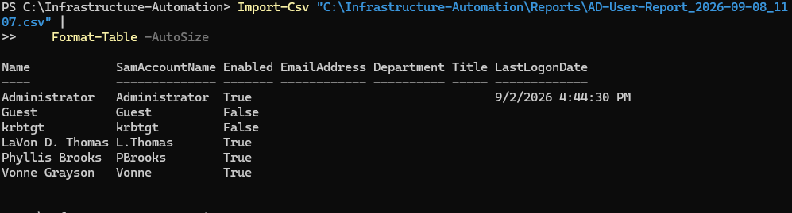
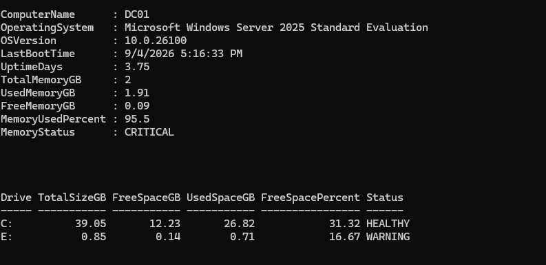
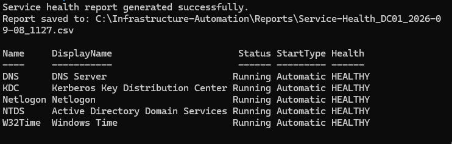
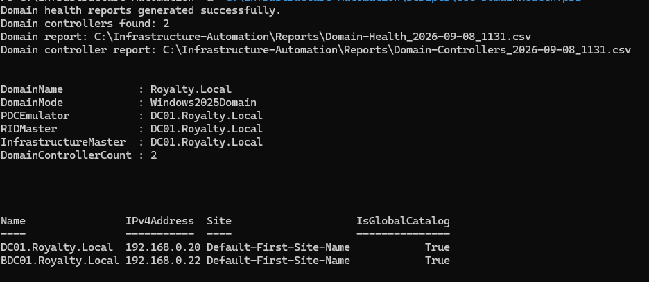
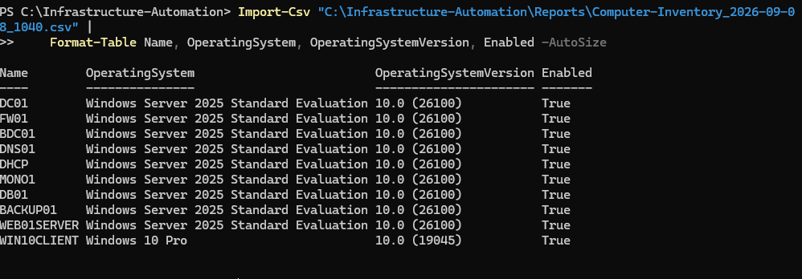

# Windows Infrastructure Automation Toolkit

A PowerShell automation toolkit designed to automate common Windows Server and Active Directory administration, monitoring, inventory, and reporting tasks within a multi-server enterprise lab environment.

The toolkit collects live infrastructure data from the Royalty.Local Active Directory environment and generates timestamped CSV reports that can be used for administrative review, troubleshooting, health monitoring, and infrastructure documentation.

## Project Objectives

- Automate repetitive Windows infrastructure administration tasks
- Collect Active Directory user and computer inventory data
- Identify disabled Active Directory accounts
- Monitor Windows Server resource utilization and system health
- Monitor critical Active Directory infrastructure services
- Collect domain controller and FSMO role information
- Apply health thresholds to identify warning and critical conditions
- Generate timestamped CSV reports for administrative analysis
- Demonstrate practical PowerShell automation in a Windows Server 2025 environment
## Technologies Used
## Automation Scripts

### Get-ADUserReport.ps1
Queries Active Directory user accounts and generates timestamped CSV reports containing account information. The script also identifies disabled accounts and exports them to a separate report for administrative review.

### Get-ComputerInventory.ps1
Queries Active Directory computer objects and generates an inventory containing computer names, operating systems, OS versions, account status, and last logon information.

### Get-ServerHealth.ps1
Collects Windows Server health information using CIM, including operating system details, uptime, memory utilization, and disk utilization. Automated thresholds classify resource conditions as HEALTHY, WARNING, or CRITICAL.

### Get-ServiceHealth.ps1
Monitors critical Active Directory and Windows infrastructure services, including DNS Server, Kerberos Key Distribution Center, Netlogon, Active Directory Domain Services, and Windows Time.

### Get-DomainHealth.ps1
Collects Active Directory domain and domain controller information, including domain functional level, FSMO role holders, domain controller count, IP addresses, Active Directory site membership, and Global Catalog status.
## Health Monitoring Thresholds

The server health automation evaluates live resource utilization and assigns health classifications to help identify potential infrastructure issues.

### Memory Utilization

| Utilization | Status |
|---|---|
| Below 80% | HEALTHY |
| 80% to below 90% | WARNING |
| 90% or higher | CRITICAL |

### Disk Free Space

| Free Space | Status |
|---|---|
| 20% or higher | HEALTHY |
| 10% to below 20% | WARNING |
| Below 10% | CRITICAL |
## Project Structure

```text
Infrastructure-Automation/
├── Scripts/
│   ├── Get-ADUserReport.ps1
│   ├── Get-ComputerInventory.ps1
│   ├── Get-DomainHealth.ps1
│   ├── Get-ServerHealth.ps1
│   └── Get-ServiceHealth.ps1
├── Reports/
│   ├── AD user and disabled account reports
│   ├── Computer inventory reports
│   ├── Server and disk health reports
│   ├── Service health reports
│   └── Domain and domain controller reports
├── Screenshots/
│   ├── AD-User-Report.png
│   ├── Computer-Inventory.png
│   ├── Domain-Health.png
│   ├── Server-Health.png
│   └── Service-Health.png
└── README.md
## Project Screenshots

### Active Directory User Reporting



### Server Health Monitoring



### Critical Service Monitoring



### Active Directory Domain Health



### Computer Inventory


## Safety and Scope
## Skills Demonstrated

- PowerShell scripting and automation
- Active Directory administration and reporting
- Windows Server infrastructure monitoring
- Windows service monitoring
- CIM-based system information collection
- Infrastructure inventory management
- Conditional logic and health-state classification
- PowerShell object and pipeline processing
- CSV report generation
- Timestamped administrative reporting
- Domain controller and FSMO role analysis
- Operational troubleshooting and validation

The scripts in this project were developed and tested in the Royalty.Local isolated home lab environment.

The reporting and monitoring scripts are designed primarily for read-only administrative visibility. They query Active Directory, Windows services, operating system information, and system resources without automatically modifying user accounts, computer objects, services, or domain configuration.

Generated CSV files and screenshots contain lab-generated data and do not represent production systems or production user information.

- PowerShell 5.1
- Windows Server 2025
- Active Directory Domain Services (AD DS)
- Active Directory PowerShell Module
- Windows Management Instrumentation / CIM
- Windows Services
- CSV-based reporting
- Royalty.Local enterprise home lab

## Author

**LaVon Thomas**  
Systems & Infrastructure Engineer  
B.S. Computer Information Systems — Cybersecurity, Post University
